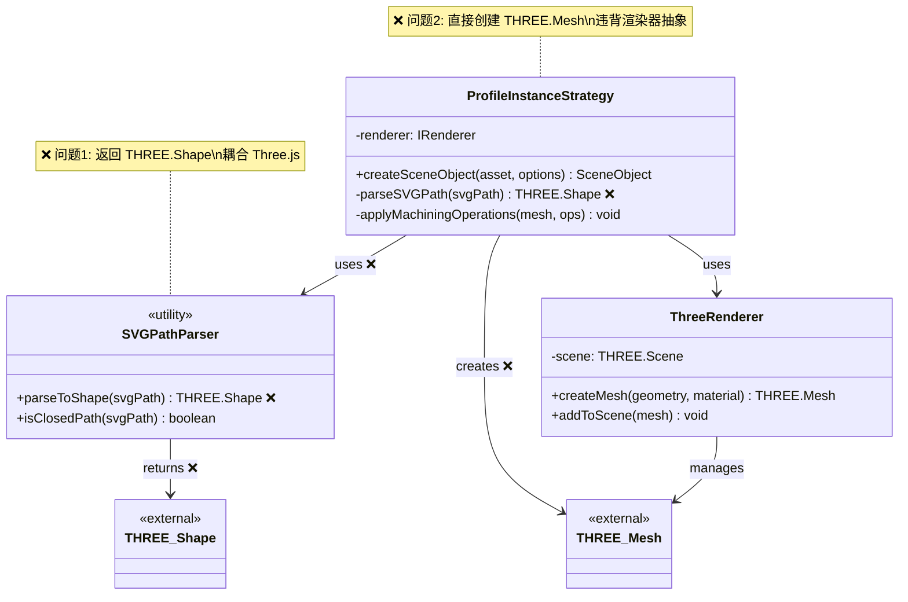
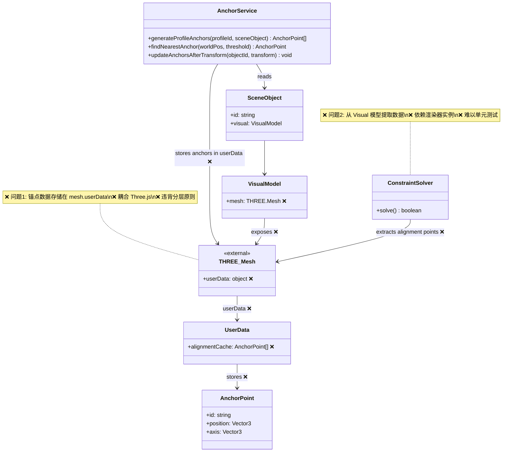

# 架构对比 - UML 结构图

**创建日期**: 2025-12-13  
**用途**: 对比当前设计与优化后设计的架构差异

---

## 1. 任务 #5 & #9 - 参数化几何生成

### 1.1 当前设计（存在问题）



**问题说明**:

- ❌ `SVGPathParser` 在 `core/renderer/threejs/utils/` 目录
- ❌ 返回 `THREE.Shape` 直接耦合 Three.js
- ❌ Strategy 层直接创建 `THREE.MeshStandardMaterial`
- ❌ 业务逻辑（SVG 解析）混入 Implementation 层

---

### 1.2 优化后设计（符合原则）

```mermaid
classDiagram
    %% ============================================
    %% Core Layer - Business Logic (渲染器无关)
    %% ============================================

    namespace CoreGeometry {
        class IShape {
            <<interface>>
            +curves: ICurve[]
            +isClosed: boolean
        }

        class ICurve {
            <<interface>>
            +type: string
            +points: Vector2[]
        }

        class SVGPathParser {
            <<pure business logic>>
            +parse(svgPath: string) IShape ✅
            +validate(svgPath: string) boolean
        }

        class GeometryDescriptor {
            +baseShape: IShape
            +extrusionLength: number
            +machiningOps: MachiningOperation[]
        }

        class MachiningOperation {
            +type: 'drill' | 'chamfer' | 'slot'
            +position: Vector3
            +dimensions: object
        }
    }

    %% ============================================
    %% Core Layer - Strategy
    %% ============================================

    class ProfileInstanceStrategy {
        -renderer: IRenderer
        +createSceneObject(asset, options) SceneObject
        -createComputeModel(asset, options) ComputeModel
        -requestVisualModel(geometry, material) MeshHandle
    }

    class SceneObject {
        +id: string
        +visual: VisualModel
        +compute: ComputeModel
    }

    class ComputeModel {
        +geometry: GeometryDescriptor
        +material: MaterialProperties
    }

    class VisualModel {
        +mesh: MeshHandle ✅
        +isVisible: boolean
    }

    %% ============================================
    %% Core Layer - Renderer Interface
    %% ============================================

    class IRenderer {
        <<interface>>
        +createExtrudedMesh(params: ExtrusionParams) MeshHandle ✅
        +applyMachiningOps(mesh: MeshHandle, ops) void
        +updateMeshTransform(mesh: MeshHandle, transform) void
    }

    class ExtrusionParams {
        +geometry: IShape ✅
        +length: number
        +material: MaterialProperties ✅
        +simplified: boolean
    }

    class MaterialProperties {
        <<value object>>
        +type: 'metal' | 'plastic'
        +color: number
        +metalness: number
        +roughness: number
    }

    class MeshHandle {
        <<opaque reference>>
        +id: string
        +type: 'mesh'
    }

    %% ============================================
    %% Renderer Implementation Layer
    %% ============================================

    namespace ThreeJSImpl {
        class ThreeRenderer {
            -scene: THREE.Scene
            -geometryAdapter: ThreeGeometryAdapter
            -csgService: ThreeCSGService
            -materialFactory: ThreeMaterialFactory
            +createExtrudedMesh(params) MeshHandle
            +applyMachiningOps(mesh, ops) void
        }

        class ThreeGeometryAdapter {
            <<adapter pattern>>
            +shapeToThreeShape(shape: IShape) THREE.Shape ✅
            +curveToThreeCurve(curve: ICurve) THREE.Curve
        }

        class ThreeCSGService {
            +subtract(base: Mesh, tool: Mesh) Mesh
            +union(a: Mesh, b: Mesh) Mesh
        }

        class ThreeMaterialFactory {
            +create(props: MaterialProperties) THREE.Material ✅
        }
    }

    %% Three.js External Types
    class THREE_Shape {
        <<external>>
    }

    class THREE_Material {
        <<external>>
    }

    class THREE_Mesh {
        <<external>>
    }

    %% ============================================
    %% Relationships - Core Layer
    %% ============================================

    ProfileInstanceStrategy --> SVGPathParser: uses ✅
    ProfileInstanceStrategy --> IRenderer: depends on interface ✅
    ProfileInstanceStrategy --> SceneObject: creates

    SceneObject *-- VisualModel
    SceneObject *-- ComputeModel
    ComputeModel *-- GeometryDescriptor
    GeometryDescriptor *-- IShape
    GeometryDescriptor *-- MachiningOperation

    SVGPathParser --> IShape: returns ✅
    IShape *-- ICurve

    VisualModel o-- MeshHandle: references ✅

    IRenderer --> MeshHandle: returns ✅
    IRenderer --> ExtrusionParams: accepts
    ExtrusionParams o-- IShape: uses ✅
    ExtrusionParams o-- MaterialProperties: uses ✅

    %% ============================================
    %% Relationships - Implementation Layer
    %% ============================================

    ThreeRenderer ..|> IRenderer: implements
    ThreeRenderer --> ThreeGeometryAdapter: uses
    ThreeRenderer --> ThreeCSGService: uses
    ThreeRenderer --> ThreeMaterialFactory: uses

    ThreeGeometryAdapter --> IShape: converts from ✅
    ThreeGeometryAdapter --> THREE_Shape: converts to

    ThreeMaterialFactory --> MaterialProperties: converts from ✅
    ThreeMaterialFactory --> THREE_Material: converts to

    ThreeRenderer --> THREE_Mesh: manages internally

    %% ============================================
    %% Design Notes
    %% ============================================

    note for SVGPathParser "✅ 纯业务逻辑\n✅ 返回抽象 IShape\n✅ 不依赖渲染库"
    note for ThreeGeometryAdapter "✅ Adapter Pattern\n✅ 技术细节隔离\n✅ 易于替换"
    note for IRenderer "✅ 抽象接口\n✅ 返回 MeshHandle\n✅ 不暴露 THREE.Mesh"
```



---

## 2. 任务 #13 - 锚点与约束系统

### 2.1 当前设计（存在问题）



**问题说明**:

- ❌ 锚点数据存储在 `mesh.userData.alignmentCache`
- ❌ Core 层业务数据依赖 Three.js 对象
- ❌ ConstraintSolver 从 Visual 模型提取对齐点
- ❌ 单元测试需要创建 Three.js mesh 实例

---

### 2.2 优化后设计（符合原则）

```mermaid
classDiagram
    %% ============================================
    %% Core Layer - Anchor System (渲染器无关)
    %% ============================================

    namespace CoreAnchor {
        class AnchorService {
            -anchorCache: Map~string, AnchorPoint[]~ ✅
            -eventEmitter: Emitter
            +generateProfileAnchors(profileId, sceneObject) AnchorPoint[]
            +findNearestAnchor(worldPos, threshold) AnchorPoint
            +updateAnchorsAfterTransform(objectId, transform) void
            +onAnchorsUpdated?: (objectId, anchors) => void ✅
        }

        class AnchorPoint {
            +id: string
            +objectId: string
            +type: AnchorType
            +localPosition: Vector3 ✅
            +worldPosition: Vector3
            +axis: Vector3
        }

        class AnchorType {
            <<enumeration>>
            VERTEX
            EDGE_MIDPOINT
            FACE_CENTER
            OBJECT_CENTER
            T_SLOT_POSITION
            THREADED_HOLE
        }

        class SnappingService {
            -anchorService: AnchorService
            -config: SnappingConfig
            +calculateSnap(position, config) SnapResult
            +onSnapOccurred?: (result) => void ✅
        }

        class SnappingConfig {
            +anchorSnap: boolean
            +gridSnap: boolean
            +angleSnap: boolean
            +threshold: number
        }
    }

    %% ============================================
    %% Core Layer - Assembly System
    %% ============================================

    namespace CoreAssembly {
        class AssemblyService {
            -constraintService: ConstraintService
            +createAssembly(connectorId, alignments) Assembly
            +validateAssembly(alignments) ValidationResult
            +generateFasteners(alignments) FastenerInstance[]
            +solveTransform(alignments) Transform
            +onAssemblyCreated?: (assembly) => void ✅
        }

        class Assembly {
            +id: string
            +connectorId: string
            +alignments: HoleAlignment[]
            +constraints: Constraint[]
            +fasteners: FastenerInstance[]
            +transform: Transform
        }

        class HoleAlignment {
            +connectorHoleId: string
            +profileId: string
            +targetType: AlignmentType
            +targetId: string
            +slotPosition?: number
        }

        class AlignmentType {
            <<enumeration>>
            TO_END_FACE_TAP
            TO_SIDE_HOLE
            TO_T_SLOT
        }
    }

    %% ============================================
    %% Core Layer - Constraint System
    %% ============================================

    namespace CoreConstraint {
        class ConstraintService {
            -constraints: Constraint[]
            +addConstraint(constraint) void
            +removeConstraint(id) void
            +getConstraintsByObject(objectId) Constraint[]
            +onConstraintAdded?: (constraint) => void ✅
            +onConstraintRemoved?: (id) => void ✅
        }

        class Constraint {
            +id: string
            +type: ConstraintType
            +objects: string[]
            +parameters: ConstraintParams
            +priority: number
            +enabled: boolean
        }

        class ConstraintType {
            <<enumeration>>
            FIXED_JOINT
            SLIDING_JOINT
            DISTANCE
            ANGLE
            PARALLEL
            PERPENDICULAR
        }

        class ConstraintSolver {
            -constraintService: ConstraintService
            +solve(constraints, sceneObjects) SolveResult
            -extractAlignmentPoints(sceneObjects) Map ✅
            -runSolver(constraints, points) Solution
        }

        class AlignmentPoint {
            +id: string
            +position: Vector3
            +axis: Vector3
        }
    }

    %% ============================================
    %% Core Layer - Scene Object (Data Model)
    %% ============================================

    class SceneObject {
        +id: string
        +assetId: string
        +transform: Transform
        +visual: VisualModel
        +compute: ComputeModel ✅
        +userParams: object
    }

    class ComputeModel {
        +geometry: GeometryDescriptor ✅
        +material: MaterialProperties
        +connections: Connection[]
    }

    class GeometryDescriptor {
        +baseShape: IShape
        +extrusionLength: number
        +crossSection: CrossSectionData ✅
    }

    class CrossSectionData {
        +vertices: Vector2[] ✅
        +edges: Edge[]
        +holes: HoleDefinition[] ✅
        +tSlots: TSlotDefinition[] ✅
    }

    class VisualModel {
        +mesh: MeshHandle ✅
        +isVisible: boolean
    }

    class MeshHandle {
        <<opaque reference>>
        +id: string
        +type: 'mesh'
    }

    %% ============================================
    %% Features Layer - Coordination & Events
    %% ============================================

    namespace FeaturesLayer {
        class AnchorManager {
            -anchorService: AnchorService
            -eventBus: EventBus
            +initialize() void
            -setupCallbacks() void ✅
        }

        class AssemblyVisualizationService {
            -renderer: IRenderer
            +showPreview(assembly) void
            +showAlignmentGuides(assembly) void
            +hidePreview() void
        }

        class ConstraintManager {
            -constraintService: ConstraintService
            -eventBus: EventBus
            +initialize() void
            -setupCallbacks() void ✅
        }
    }

    %% ============================================
    %% Relationships - Core Anchor System
    %% ============================================

    AnchorService --> AnchorPoint: manages in cache ✅
    AnchorService --> SceneObject: reads compute model ✅
    AnchorService --> ComputeModel: extracts geometry ✅
    ComputeModel --> GeometryDescriptor
    GeometryDescriptor --> CrossSectionData
    CrossSectionData --> HoleDefinition: contains
    CrossSectionData --> TSlotDefinition: contains

    SnappingService --> AnchorService: uses
    SnappingService --> SnappingConfig: uses

    %% ============================================
    %% Relationships - Core Assembly System
    %% ============================================

    AssemblyService --> Assembly: creates
    AssemblyService --> ConstraintService: uses
    Assembly *-- HoleAlignment
    Assembly *-- Constraint
    HoleAlignment --> AlignmentType

    %% ============================================
    %% Relationships - Core Constraint System
    %% ============================================

    ConstraintService --> Constraint: manages
    Constraint --> ConstraintType

    ConstraintSolver --> ConstraintService: uses
    ConstraintSolver --> SceneObject: reads compute model ✅
    ConstraintSolver --> ComputeModel: extracts alignment points ✅
    ConstraintSolver --> AlignmentPoint: computes from geometry ✅

    %% ============================================
    %% Relationships - Scene Object
    %% ============================================

    SceneObject *-- VisualModel
    SceneObject *-- ComputeModel
    VisualModel o-- MeshHandle: opaque reference ✅

    %% ============================================
    %% Relationships - Features Layer (Callbacks)
    %% ============================================

    AnchorManager --> AnchorService: sets callbacks ✅
    AnchorManager --> EventBus: publishes events

    AssemblyVisualizationService --> Assembly: visualizes
    AssemblyVisualizationService --> IRenderer: uses

    ConstraintManager --> ConstraintService: sets callbacks ✅
    ConstraintManager --> EventBus: publishes events

    %% ============================================
    %% Design Notes
    %% ============================================

    note for AnchorService "✅ 锚点存储在 Map\n✅ 不依赖渲染器\n✅ 从 Compute 模型提取\n✅ 通过回调报告变化"

    note for ConstraintSolver "✅ 从 SceneObject.compute 提取\n✅ 不依赖 visual.mesh\n✅ 易于单元测试\n✅ 渲染器无关"

    note for AnchorManager "✅ Features 层连接器\n✅ 回调 -> EventBus\n✅ 符合通信分层规则"

    note for CrossSectionData "✅ 包含孔位和槽位信息\n✅ 完整几何描述\n✅ 用于锚点计算"
```



---

## 3. 关键改进对比总结

### 3.1 几何处理（任务 #5, #9）

| 方面         | 当前设计 ❌                        | 优化设计 ✅                                          |
| ------------ | ---------------------------------- | ---------------------------------------------------- |
| **SVG 解析** | 返回 `THREE.Shape`，耦合 Three.js  | 返回抽象 `IShape`，渲染器无关                        |
| **几何位置** | `core/renderer/threejs/utils/`     | `core/geometry/`（独立模块）                         |
| **材质创建** | Strategy 直接创建 `THREE.Material` | Strategy 使用 `MaterialProperties`，由 Renderer 适配 |
| **CSG 操作** | 位置不明确                         | ThreeCSGService（Implementation 层）                 |
| **可测试性** | 需要 Three.js 环境                 | 纯业务逻辑，易于测试                                 |

### 3.2 锚点约束（任务 #13）

| 方面         | 当前设计 ❌                    | 优化设计 ✅                                  |
| ------------ | ------------------------------ | -------------------------------------------- |
| **锚点存储** | `mesh.userData.alignmentCache` | `AnchorService` 的 `Map<objectId, Anchor[]>` |
| **数据来源** | 从 Visual 模型（THREE.Mesh）   | 从 Compute 模型（GeometryDescriptor）        |
| **依赖关系** | Core 依赖 Three.js             | Core 完全独立                                |
| **通信方式** | 未明确（可能直接 EventBus）    | 回调模式 + Features 层发布事件               |
| **可测试性** | 需要创建 THREE.Mesh            | 不需要渲染器，纯数据测试                     |
| **可替换性** | 耦合 Three.js                  | 可切换任意渲染器                             |

### 3.3 架构层级

#### 当前设计问题：

```
Core Layer (业务逻辑)
    ↓
❌ 直接依赖 THREE.Mesh
❌ 直接依赖 THREE.Shape
❌ 数据存储在 mesh.userData
    ↓
Three.js (技术实现)
```

#### 优化后设计：

```
Core Layer (业务逻辑)
    ↓ 依赖抽象接口
IRenderer / IShape / MeshHandle (抽象层)
    ↓ 实现接口
Implementation Layer (技术实现)
    ├─ ThreeGeometryAdapter (IShape -> THREE.Shape)
    ├─ ThreeMaterialFactory (MaterialProperties -> THREE.Material)
    ├─ ThreeRenderer (IRenderer)
    └─ ThreeCSGService (CSG operations)
```

---

## 4. 设计原则遵循情况

### 4.1 分层架构原则

| 原则                       | 当前设计                 | 优化设计                |
| -------------------------- | ------------------------ | ----------------------- |
| Core 不依赖 Implementation | ❌ 依赖 THREE.Shape/Mesh | ✅ 只依赖抽象接口       |
| 业务逻辑在 Core 层         | ❌ SVG 解析在 renderer/  | ✅ 移到 core/geometry/  |
| 数据存储在 Core 层         | ❌ 锚点在 mesh.userData  | ✅ 锚点在 AnchorService |

### 4.2 通信分层规则

| 层级                   | 当前设计             | 优化设计    |
| ---------------------- | -------------------- | ----------- |
| Core ↔ Implementation | ❌ 未明确            | ✅ 回调函数 |
| Core → Features        | ❌ 可能直接 EventBus | ✅ 回调模式 |
| Features → UI          | ✅ EventBus          | ✅ EventBus |

### 4.3 渲染器抽象原则

| 原则             | 当前设计           | 优化设计                |
| ---------------- | ------------------ | ----------------------- |
| 不暴露渲染库类型 | ❌ 暴露 THREE.Mesh | ✅ 返回 MeshHandle      |
| 适配器模式       | ❌ 缺失            | ✅ ThreeGeometryAdapter |
| 易于替换         | ❌ 困难            | ✅ 容易                 |

---

## 5. 迁移路径建议

### Phase 1: 创建抽象层（不破坏现有代码）

```typescript
// 1. 创建抽象几何接口
core/geometry/IShape.ts
core/geometry/SVGPathParser.ts

// 2. 创建适配器
core/renderer/threejs/adapters/ThreeGeometryAdapter.ts
core/renderer/threejs/adapters/ThreeMaterialFactory.ts

// 3. 扩展 IRenderer 接口
core/renderer/renderer-types.ts (添加 createExtrudedMesh)
```

### Phase 2: 重构 Strategy（使用新抽象）

```typescript
// 4. 修改 ProfileInstanceStrategy
core/object/strategies/ProfileInstanceStrategy.ts
  - 使用 SVGPathParser.parse() 返回 IShape
  - 使用 MaterialProperties 代替 THREE.Material
  - 调用 renderer.createExtrudedMesh()
```

### Phase 3: 迁移锚点存储

```typescript
// 5. 重构 AnchorService
core/anchor/AnchorService.ts
  - 添加 anchorCache: Map<string, AnchorPoint[]>
  - 从 SceneObject.compute 提取锚点
  - 移除 mesh.userData 依赖

// 6. 更新 CrossSectionData
core/geometry/CrossSectionData.ts
  - 添加 holes, tSlots 信息
  - 用于锚点计算
```

### Phase 4: 重构约束求解器

```typescript
// 7. 更新 ConstraintSolver
core/constraint/ConstraintSolver.ts
  - 从 sceneObjects.compute 提取 AlignmentPoint
  - 移除对 visual.mesh 的依赖
```

### Phase 5: 添加通信层

```typescript
// 8. 创建 Features 层管理器
features/designer/services/AnchorManager.ts
features/designer/services/ConstraintManager.ts
  - 设置 Core 服务的回调
  - 连接回调到 EventBus
```

---

## 6. 验收标准

### 几何处理模块

- [ ] `SVGPathParser` 返回 `IShape`（不依赖 Three.js）
- [ ] `ProfileInstanceStrategy` 不直接创建 `THREE.Material`
- [ ] 单元测试不需要 Three.js 环境
- [ ] 可以轻松添加 Babylon.js Adapter

### 锚点约束模块

- [ ] 锚点数据存储在 `AnchorService.anchorCache`
- [ ] `ConstraintSolver` 从 `compute` 模型提取数据
- [ ] Core 服务通过回调报告状态
- [ ] Features 层连接回调到 EventBus
- [ ] 单元测试不需要创建 THREE.Mesh

---

**文档版本**: 1.0  
**下一步**: 根据 Phase 1-5 开始实现重构
