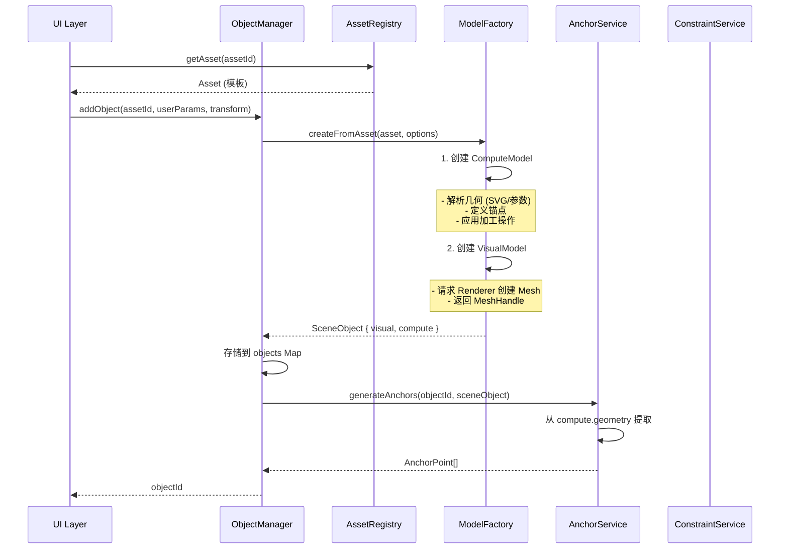
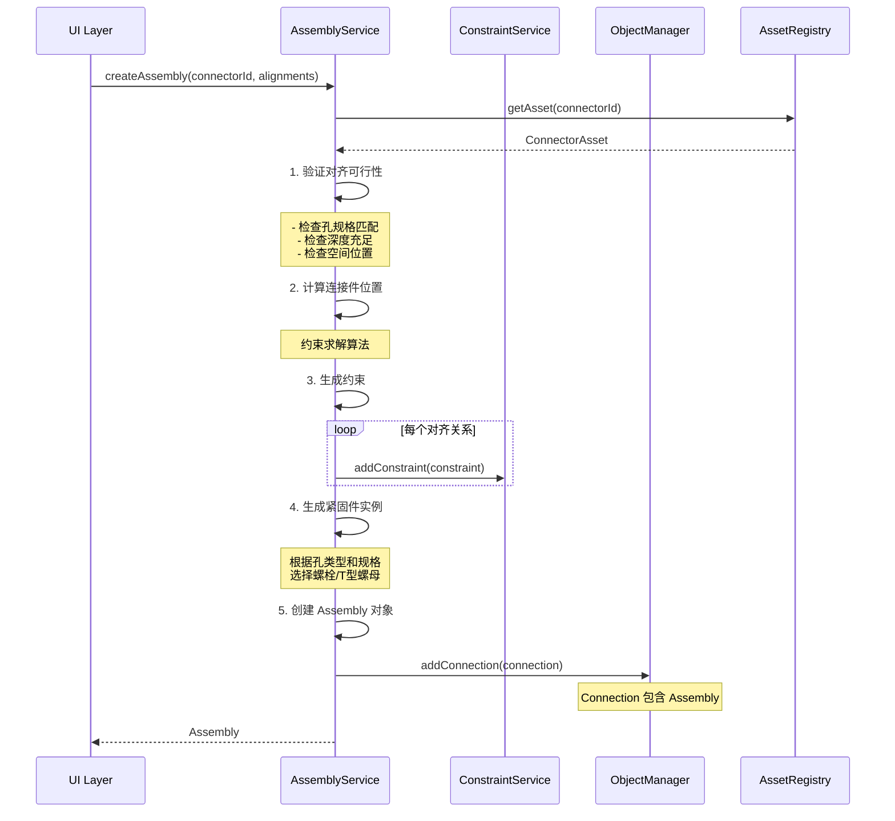
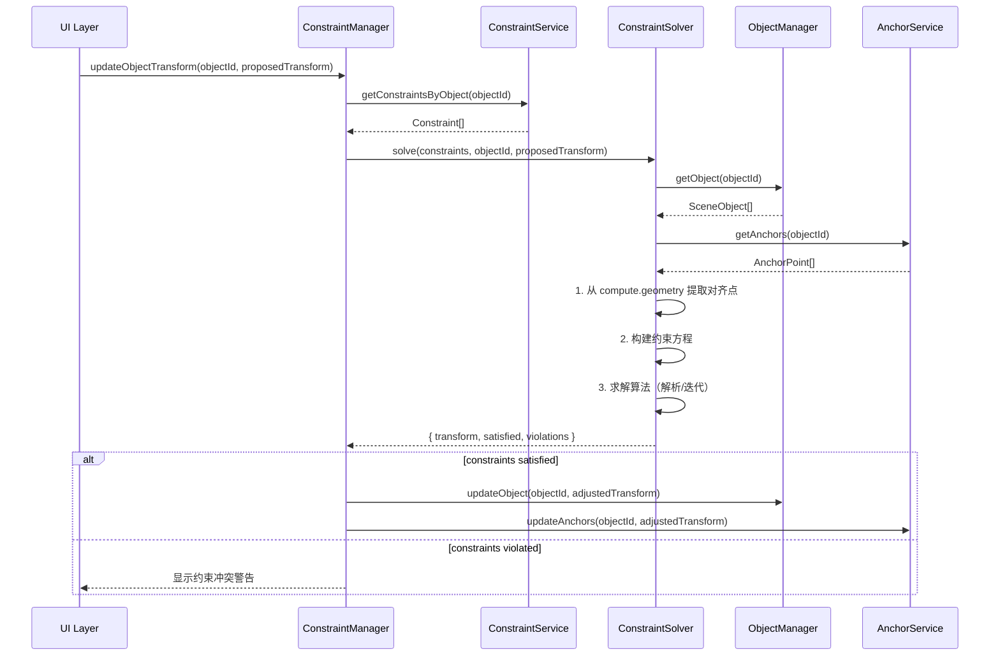
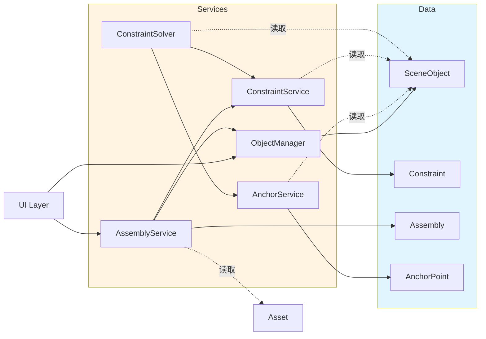

# 数据组织架构 - 完整 UML 类图

**创建日期**: 2025-12-14  
**用途**: 说明系统中所有核心概念（Asset、SceneObject、Mesh、约束、装配）的数据组织关系

---

## 1. 完整数据组织架构图

```mermaid
classDiagram
    %% ============================================
    %% Asset Layer - 模板/类定义（不可变）
    %% ============================================

    class Asset {
        <<abstract>>
        +id: string
        +name: string
        +type: AssetType
        +category: string
        +tags: string[]
        +thumbnail: string
        +parameters: ParameterDefinition[]
    }

    class ProfileAsset {
        +type: 'profile'
        +crossSection: CrossSectionDefinition
        +material: MaterialSpec
        +connectionFeatures: ProfileConnectionFeatures
    }

    class ConnectorAsset {
        +type: 'connector'
        +holes: ConnectorHole[]
        +dimensions: Dimensions
        +isInternalConnector: boolean
    }

    class FastenerAsset {
        +type: 'fastener'
        +fastenerType: 'bolt' | 't-nut' | 'set-screw'
        +threadSpec: ThreadSpec
        +length: number
    }

    class CrossSectionDefinition {
        +path: string
        +width: number
        +height: number
        +wallThickness: number
    }

    class ProfileConnectionFeatures {
        +endFaceTappable: boolean
        +endFaceThreadSpec: ThreadSpec[]
        +endFaceMaxDepth: number
        +sideDrillable: boolean
        +tSlotConfig?: TSlotConfig
    }

    class ConnectorHole {
        +id: string
        +localPosition: Vector3
        +localAxis: Vector3
        +holeType: HoleType
        +spec: HoleSpec
    }

    %% ============================================
    %% SceneObject Layer - 实例（可变）
    %% ============================================

    class SceneObject {
        +id: string
        +name: string
        +assetId: string
        +transform: Transform
        +userParams: Record~string, any~
        +visual: VisualModel
        +compute: ComputeModel
        +metadata: ObjectMetadata
    }

    class Transform {
        +position: Vector3
        +rotation: Quaternion
        +scale: Vector3
    }

    class ObjectMetadata {
        +createdAt: timestamp
        +updatedAt: timestamp
        +locked: boolean
        +visible: boolean
        +selectable: boolean
    }

    %% ============================================
    %% Visual Model - 渲染数据（简化几何）
    %% ============================================

    class VisualModel {
        +mesh: MeshHandle
        +isVisible: boolean
        +material?: MaterialOverride
        +renderHints: RenderHints
    }

    class MeshHandle {
        <<opaque reference>>
        +id: string
        +type: 'mesh'
    }

    class RenderHints {
        +castShadow: boolean
        +receiveShadow: boolean
        +renderOrder: number
        +frustumCulled: boolean
    }

    %% ============================================
    %% Compute Model - 计算数据（完整几何）
    %% ============================================

    class ComputeModel {
        +geometry: GeometryDescriptor
        +material: MaterialProperties
        +anchors: AnchorDefinition[]
        +connections: Connection[]
        +machiningOps: MachiningOperation[]
    }

    class GeometryDescriptor {
        +type: 'extrusion' | 'primitive' | 'mesh'
        +baseShape?: IShape
        +extrusionLength?: number
        +primitiveType?: string
        +crossSection?: CrossSectionData
    }

    class CrossSectionData {
        +vertices: Vector2[]
        +edges: Edge[]
        +holes: HoleDefinition[]
        +tSlots: TSlotDefinition[]
        +boundingBox: BBox2D
    }

    class HoleDefinition {
        +id: string
        +position: Vector2
        +type: HoleType
        +diameter: number
        +depth: number
        +threadSpec?: ThreadSpec
    }

    class TSlotDefinition {
        +id: string
        +face: 'top' | 'bottom' | 'left' | 'right'
        +centerline: Vector2[]
        +profile: TSlotProfile
    }

    class AnchorDefinition {
        +id: string
        +type: AnchorType
        +localPosition: Vector3
        +localAxis: Vector3
        +metadata: object
    }

    class MachiningOperation {
        +id: string
        +type: 'drill' | 'chamfer' | 'slot' | 'tap'
        +position: Vector3
        +dimensions: object
        +parameters: object
    }

    %% ============================================
    %% Connection System - 连接关系
    %% ============================================

    class Connection {
        +id: string
        +type: ConnectionType
        +fromObjectId: string
        +toObjectId: string
        +assembly?: Assembly
    }

    class ConnectionType {
        <<enumeration>>
        FIXED_JOINT
        SLIDING_JOINT
        HINGE_JOINT
        CUSTOM
    }

    class Assembly {
        +id: string
        +connectorId: string
        +alignments: HoleAlignment[]
        +constraints: Constraint[]
        +fasteners: FastenerInstance[]
        +transform: Transform
        +validationStatus: ValidationStatus
    }

    class HoleAlignment {
        +connectorHoleId: string
        +profileId: string
        +targetType: AlignmentType
        +targetId: string
        +slotPosition?: number
    }

    class FastenerInstance {
        +assetId: string
        +type: FastenerType
        +threadSpec: ThreadSpec
        +length: number
        +position: Vector3
        +axis: Vector3
        +sceneObjectId?: string
    }

    %% ============================================
    %% Constraint System - 约束系统
    %% ============================================

    class Constraint {
        +id: string
        +type: ConstraintType
        +objectIds: string[]
        +parameters: ConstraintParameters
        +priority: number
        +enabled: boolean
        +satisfied: boolean
    }

    class ConstraintType {
        <<enumeration>>
        DISTANCE
        ANGLE
        PARALLEL
        PERPENDICULAR
        CONCENTRIC
        COPLANAR
        FIXED_JOINT
        SLIDING_JOINT
    }

    class ConstraintParameters {
        +distance?: number
        +angle?: number
        +axis?: Vector3
        +tolerance?: number
        +anchorIds?: string[]
    }

    %% ============================================
    %% Anchor System - 锚点系统（运行时）
    %% ============================================

    class AnchorPoint {
        +id: string
        +objectId: string
        +type: AnchorType
        +localPosition: Vector3
        +worldPosition: Vector3
        +localAxis: Vector3
        +worldAxis: Vector3
        +metadata: object
    }

    class AnchorType {
        <<enumeration>>
        VERTEX
        EDGE_MIDPOINT
        FACE_CENTER
        OBJECT_CENTER
        T_SLOT_POSITION
        THREADED_HOLE
        END_FACE
        CUSTOM
    }

    %% ============================================
    %% Service Layer - 数据管理服务
    %% ============================================

    class AssetRegistry {
        -assets: Map~string, Asset~
        +register(asset: Asset) void
        +getAsset(id: string) Asset
        +findAssets(filter: AssetFilter) Asset[]
    }

    class ObjectManager {
        -objects: Map~string, SceneObject~
        -connections: Map~string, Connection~
        +addObject(object: SceneObject) void
        +getObject(id: string) SceneObject
        +updateObject(id: string, updates: Partial) void
        +removeObject(id: string) void
        +addConnection(connection: Connection) void
        +getConnectionsByObject(objectId: string) Connection[]
    }

    class AnchorService {
        -anchorCache: Map~string, AnchorPoint[]~
        +generateAnchors(objectId: string) AnchorPoint[]
        +getAnchors(objectId: string) AnchorPoint[]
        +updateAnchors(objectId: string, transform: Transform) void
        +findNearestAnchor(worldPos: Vector3, threshold: number) AnchorPoint
    }

    class ConstraintService {
        -constraints: Map~string, Constraint~
        +addConstraint(constraint: Constraint) void
        +getConstraint(id: string) Constraint
        +getConstraintsByObject(objectId: string) Constraint[]
        +removeConstraint(id: string) void
        +validateConstraints() ValidationResult
    }

    class AssemblyService {
        +createAssembly(connectorId: string, alignments: HoleAlignment[]) Assembly
        +validateAssembly(assembly: Assembly) ValidationResult
        +updateAssembly(assemblyId: string, updates: Partial) void
        +disassemble(assemblyId: string) void
    }

    %% ============================================
    %% Relationships - Asset Layer
    %% ============================================

    Asset <|-- ProfileAsset
    Asset <|-- ConnectorAsset
    Asset <|-- FastenerAsset

    ProfileAsset *-- CrossSectionDefinition
    ProfileAsset *-- ProfileConnectionFeatures
    ConnectorAsset *-- ConnectorHole

    %% ============================================
    %% Relationships - SceneObject Layer
    %% ============================================

    SceneObject --> Asset: references by assetId
    SceneObject *-- Transform
    SceneObject *-- VisualModel
    SceneObject *-- ComputeModel
    SceneObject *-- ObjectMetadata

    VisualModel o-- MeshHandle: opaque reference
    VisualModel *-- RenderHints

    %% ============================================
    %% Relationships - Compute Model
    %% ============================================

    ComputeModel *-- GeometryDescriptor
    ComputeModel *-- MaterialProperties
    ComputeModel *-- AnchorDefinition
    ComputeModel *-- Connection
    ComputeModel *-- MachiningOperation

    GeometryDescriptor *-- CrossSectionData
    CrossSectionData *-- HoleDefinition
    CrossSectionData *-- TSlotDefinition

    %% ============================================
    %% Relationships - Connection System
    %% ============================================

    Connection --> SceneObject: fromObjectId
    Connection --> SceneObject: toObjectId
    Connection *-- Assembly
    Connection --> ConnectionType

    Assembly --> ConnectorAsset: connectorId
    Assembly *-- HoleAlignment
    Assembly *-- Constraint
    Assembly *-- FastenerInstance
    Assembly *-- Transform

    FastenerInstance --> FastenerAsset: assetId
    FastenerInstance --> SceneObject: sceneObjectId (optional)

    %% ============================================
    %% Relationships - Constraint System
    %% ============================================

    Constraint --> SceneObject: objectIds (array)
    Constraint --> ConstraintType
    Constraint *-- ConstraintParameters

    ConstraintParameters --> AnchorPoint: anchorIds (optional)

    %% ============================================
    %% Relationships - Anchor System
    %% ============================================

    AnchorPoint --> SceneObject: objectId
    AnchorPoint --> AnchorType
    AnchorPoint --> AnchorDefinition: derived from

    %% ============================================
    %% Relationships - Service Layer
    %% ============================================

    AssetRegistry --> Asset: manages

    ObjectManager --> SceneObject: manages
    ObjectManager --> Connection: manages

    AnchorService --> AnchorPoint: manages cache
    AnchorService --> SceneObject: reads compute model

    ConstraintService --> Constraint: manages
    ConstraintService --> SceneObject: references

    AssemblyService --> Assembly: creates/manages
    AssemblyService --> ConstraintService: uses
    AssemblyService --> ObjectManager: uses

    %% ============================================
    %% Design Notes
    %% ============================================

    note for Asset "模板层（不可变）\n定义素材的类型和参数\n可被多个 SceneObject 引用"

    note for SceneObject "实例层（可变）\n场景中的实际对象\n包含 Visual 和 Compute 双模型"

    note for ComputeModel "完整几何描述\n用于约束求解、FEA 分析\n包含锚点定义和连接信息"

    note for VisualModel "简化渲染模型\n通过 MeshHandle 引用\n不暴露底层渲染库类型"

    note for Assembly "装配信息\n描述连接件如何连接型材\n包含对齐、约束、紧固件"

    note for Constraint "约束关系\n可独立于装配存在\n用于参数化设计"

    note for AnchorPoint "运行时锚点\n从 ComputeModel 计算得出\n缓存在 AnchorService 中"
```



---

## 2. 数据流转关系图

### 2.1 创建对象的数据流



### 2.2 创建装配的数据流



### 2.3 约束求解的数据流



---

## 3. 数据存储位置总览

### 3.1 内存数据结构

| 数据类型        | 存储位置             | 数据结构                        | 生命周期                       |
| --------------- | -------------------- | ------------------------------- | ------------------------------ |
| **Asset**       | `AssetRegistry`      | `Map<assetId, Asset>`           | 应用启动时加载，全局共享       |
| **SceneObject** | `ObjectManager`      | `Map<objectId, SceneObject>`    | 场景加载时创建，场景卸载时销毁 |
| **Connection**  | `ObjectManager`      | `Map<connectionId, Connection>` | 创建装配时添加，拆卸时移除     |
| **Constraint**  | `ConstraintService`  | `Map<constraintId, Constraint>` | 添加约束时创建，移除约束时销毁 |
| **AnchorPoint** | `AnchorService`      | `Map<objectId, AnchorPoint[]>`  | 对象创建时生成，对象删除时清除 |
| **MeshHandle**  | `SceneObject.visual` | 引用                            | 对象创建时分配，对象删除时释放 |
| **实际 Mesh**   | `ThreeRenderer`      | `Map<meshHandleId, THREE.Mesh>` | Renderer 内部管理              |

### 3.2 数据持久化

```typescript
// 场景序列化（保存到 localStorage/云端）
interface SerializedScene {
  version: string;
  objects: SerializedSceneObject[];
  connections: SerializedConnection[];
  constraints: SerializedConstraint[];
  metadata: SceneMetadata;
}

interface SerializedSceneObject {
  id: string;
  assetId: string; // 引用 Asset
  transform: Transform;
  userParams: object;
  compute: {
    // 保存完整几何描述
    geometry: GeometryDescriptor;
    material: MaterialProperties;
    machiningOps: MachiningOperation[];
  };
  // visual 不序列化（重建时重新创建）
}

interface SerializedConnection {
  id: string;
  type: ConnectionType;
  fromObjectId: string;
  toObjectId: string;
  assembly?: SerializedAssembly;
}

interface SerializedAssembly {
  connectorId: string; // 引用 ConnectorAsset
  alignments: HoleAlignment[];
  constraints: string[]; // 引用 Constraint ID
  fasteners: FastenerInstance[];
}

interface SerializedConstraint {
  id: string;
  type: ConstraintType;
  objectIds: string[];
  parameters: ConstraintParameters;
}
```

---

## 4. 关键数据关系说明

### 4.1 Asset vs SceneObject

```
Asset (1) ──────> (N) SceneObject
  │                      │
  │                      ├── visual: { mesh: MeshHandle }
  │                      ├── compute: { geometry, material, anchors }
  │                      └── transform: { position, rotation, scale }
  │
  └── 定义参数和默认值

示例:
- Asset: "2020型材" (id: "profile-2020")
  - crossSection.path: "M0,0 L20,0 L20,20 ..."
  - length.default: 500

- SceneObject 1: (assetId: "profile-2020")
  - userParams.length: 800
  - transform.position: [0, 0, 0]

- SceneObject 2: (assetId: "profile-2020")
  - userParams.length: 1200
  - transform.position: [100, 0, 0]
```

### 4.2 Connection vs Assembly vs Constraint

```
Connection (连接关系)
  │
  ├── type: FIXED_JOINT | SLIDING_JOINT
  ├── fromObjectId: "profile-1"
  ├── toObjectId: "profile-2"
  └── assembly?: Assembly
        │
        ├── connectorId: "bracket-90deg"  (引用 ConnectorAsset)
        ├── alignments: [                  (孔对齐信息)
        │     { connectorHoleId: "hole-1", profileId: "profile-1", ... }
        │   ]
        ├── constraints: [                 (生成的约束)
        │     Constraint { type: DISTANCE, ... }
        │   ]
        └── fasteners: [                   (螺栓实例)
              FastenerInstance { assetId: "bolt-m5-20", ... }
            ]

约束可独立存在（不属于 Assembly）:
Constraint
  ├── type: PARALLEL | PERPENDICULAR | DISTANCE
  ├── objectIds: ["profile-1", "profile-3"]
  └── parameters: { distance: 100, tolerance: 0.1 }
```

### 4.3 AnchorDefinition vs AnchorPoint

```
ComputeModel.anchors: AnchorDefinition[]  (静态定义)
  │
  │  描述: 在对象局部坐标系中的锚点位置
  │  示例: { type: END_FACE, localPosition: [0, 0, 0], localAxis: [1, 0, 0] }
  │
  └─> 对象创建时传递给 AnchorService

AnchorService.anchorCache: Map<objectId, AnchorPoint[]>  (运行时缓存)
  │
  │  描述: 计算好的世界坐标锚点，用于吸附和约束求解
  │  示例: {
  │    type: END_FACE,
  │    localPosition: [0, 0, 0],
  │    worldPosition: [100, 50, 200],  // 应用了 transform
  │    localAxis: [1, 0, 0],
  │    worldAxis: [0.707, 0.707, 0]    // 应用了旋转
  │  }
  │
  └─> 对象 transform 更新时，重新计算 worldPosition 和 worldAxis
```

---

## 5. 典型使用场景的数据组织

### 5.1 场景：用户拖拽放置型材

```typescript
// 1. 用户从库中选择型材
const asset = assetRegistry.getAsset('profile-2020');

// 2. 创建场景对象
const sceneObject = modelFactory.createFromAsset(asset, {
  userParams: { length: 800 },
  transform: { position: [0, 0, 0], rotation: [0, 0, 0], scale: [1, 1, 1] }
});

// sceneObject 结构:
{
  id: "obj-uuid-1",
  assetId: "profile-2020",
  transform: { position: [0, 0, 0], ... },
  userParams: { length: 800 },

  visual: {
    mesh: MeshHandle { id: "mesh-uuid-1" },  // 引用 Renderer 中的 THREE.Mesh
    isVisible: true
  },

  compute: {
    geometry: {
      type: 'extrusion',
      baseShape: IShape { curves: [...] },
      extrusionLength: 800,
      crossSection: {
        vertices: [[0,0], [20,0], [20,20], [0,20]],
        holes: [
          { id: "hole-1", position: [10, 10], diameter: 5, depth: 10 }
        ],
        tSlots: [
          { id: "slot-1", face: 'top', centerline: [...] }
        ]
      }
    },
    material: { type: 'metal', color: 0xcccccc },
    anchors: [
      { id: "anchor-end-1", type: END_FACE, localPosition: [0, 0, 0] },
      { id: "anchor-end-2", type: END_FACE, localPosition: [800, 0, 0] },
      { id: "anchor-hole-1", type: THREADED_HOLE, localPosition: [10, 10, 0] }
    ]
  }
}

// 3. ObjectManager 存储
objectManager.addObject(sceneObject);

// 4. AnchorService 生成运行时锚点
const anchorPoints = anchorService.generateAnchors('obj-uuid-1', sceneObject);
// anchorPoints 缓存在 AnchorService.anchorCache.get('obj-uuid-1')
```

### 5.2 场景：用户使用角码连接两根型材

```typescript
// 1. 用户选择连接件
const connectorAsset = assetRegistry.getAsset('bracket-90deg');
// connectorAsset.holes = [
//   { id: "hole-1", localPosition: [0, 0, 0], threadSpec: 'M5' },
//   { id: "hole-2", localPosition: [40, 0, 0], threadSpec: 'M5' }
// ]

// 2. 用户指定对齐关系
const alignments = [
  {
    connectorHoleId: "hole-1",
    profileId: "obj-uuid-1",
    targetType: 'TO_END_FACE_TAP',
    targetId: "anchor-hole-1"
  },
  {
    connectorHoleId: "hole-2",
    profileId: "obj-uuid-2",
    targetType: 'TO_END_FACE_TAP',
    targetId: "anchor-hole-2"
  }
];

// 3. 创建装配
const assembly = assemblyService.createAssembly('bracket-90deg', alignments);

// assembly 结构:
{
  id: "assembly-uuid-1",
  connectorId: "bracket-90deg",
  alignments: [...],

  constraints: [
    {
      id: "constraint-1",
      type: DISTANCE,
      objectIds: ["obj-uuid-1", "bracket-instance"],
      parameters: { distance: 0, tolerance: 0.01 }
    },
    {
      id: "constraint-2",
      type: ANGLE,
      objectIds: ["obj-uuid-1", "obj-uuid-2"],
      parameters: { angle: 90, tolerance: 1 }
    }
  ],

  fasteners: [
    {
      assetId: "bolt-m5-20",
      type: 'bolt',
      threadSpec: 'M5',
      length: 20,
      position: [0, 0, 0],
      axis: [1, 0, 0],
      sceneObjectId: "fastener-obj-1"  // 如果紧固件也创建为 SceneObject
    },
    {
      assetId: "bolt-m5-20",
      type: 'bolt',
      threadSpec: 'M5',
      length: 20,
      position: [40, 0, 0],
      axis: [1, 0, 0],
      sceneObjectId: "fastener-obj-2"
    }
  ],

  transform: {
    // 计算出的连接件位置
    position: [10, 10, 10],
    rotation: [0, 0, 90]
  }
}

// 4. 创建连接关系
const connection = {
  id: "connection-uuid-1",
  type: FIXED_JOINT,
  fromObjectId: "obj-uuid-1",
  toObjectId: "obj-uuid-2",
  assembly: assembly
};

objectManager.addConnection(connection);

// 5. 约束服务管理约束
assembly.constraints.forEach(constraint => {
  constraintService.addConstraint(constraint);
});
```

---

## 6. 数据查询接口

### 6.1 常见查询操作

```typescript
// 查询 Asset
assetRegistry.getAsset('profile-2020');
assetRegistry.findAssets({ type: 'profile', category: 'aluminum' });

// 查询 SceneObject
objectManager.getObject('obj-uuid-1');
objectManager.getAllObjects();
objectManager.findObjectsByAsset('profile-2020');

// 查询连接关系
objectManager.getConnectionsByObject('obj-uuid-1');
// 返回: [
//   { fromObjectId: "obj-uuid-1", toObjectId: "obj-uuid-2", ... }
// ]

// 查询约束
constraintService.getConstraintsByObject('obj-uuid-1');
// 返回: 所有涉及该对象的约束

// 查询锚点
anchorService.getAnchors('obj-uuid-1');
anchorService.findNearestAnchor([100, 50, 200], 5);

// 图查询：找到所有连接的对象
function getConnectedObjects(objectId: string): string[] {
  const connections = objectManager.getConnectionsByObject(objectId);
  return connections.map(conn =>
    conn.fromObjectId === objectId ? conn.toObjectId : conn.fromObjectId
  );
}

// 递归查询：构建装配树
function buildAssemblyTree(rootObjectId: string): AssemblyTree {
  const visited = new Set();
  function traverse(objectId: string): AssemblyNode {
    if (visited.has(objectId)) return null;
    visited.add(objectId);

    const object = objectManager.getObject(objectId);
    const connections = objectManager.getConnectionsByObject(objectId);

    return {
      object,
      children: connections
        .map(conn => {
          const childId =
            conn.fromObjectId === objectId
              ? conn.toObjectId
              : conn.fromObjectId;
          return traverse(childId);
        })
        .filter(Boolean),
    };
  }

  return traverse(rootObjectId);
}
```

---

## 7. 设计要点总结

### 7.1 数据分层清晰

```
Asset Layer (模板层)
  ↓ 引用
SceneObject Layer (实例层)
  ↓ 包含
Visual/Compute Model (双模型)
  ↓ 引用
Connection/Constraint (关系层)
```

### 7.2 引用关系明确

- **SceneObject → Asset**: 通过 `assetId` 字符串引用（避免循环依赖）
- **Connection → SceneObject**: 通过 `fromObjectId`/`toObjectId` 引用
- **Constraint → SceneObject**: 通过 `objectIds[]` 引用
- **AnchorPoint → SceneObject**: 通过 `objectId` 引用
- **FastenerInstance → FastenerAsset**: 通过 `assetId` 引用

### 7.3 数据独立性

- **Asset** 独立于 **SceneObject**（可预加载、可共享）
- **Compute** 独立于 **Visual**（可离线计算、可替换渲染器）
- **AnchorPoint** 独立于 **Mesh**（缓存在 AnchorService，不依赖渲染器）
- **Constraint** 独立于 **Assembly**（可单独创建参数化约束）

### 7.4 可序列化性

- 保存场景时：序列化 SceneObject、Connection、Constraint
- 不序列化：VisualModel（重建时重新创建）、AnchorPoint（运行时计算）
- Asset 不需要序列化（全局共享，应用启动加载）

---

## 8. 依赖关系分析（单向依赖检查）

### 8.1 依赖关系图

```mermaid
graph TD
    %% Asset Layer
    Asset[Asset Layer]
    ProfileAsset[ProfileAsset]
    ConnectorAsset[ConnectorAsset]
    FastenerAsset[FastenerAsset]

    %% SceneObject Layer
    SceneObject[SceneObject]
    VisualModel[VisualModel]
    ComputeModel[ComputeModel]
    GeometryDescriptor[GeometryDescriptor]

    %% Relationship Layer
    Connection[Connection]
    Assembly[Assembly]
    Constraint[Constraint]

    %% Runtime Layer
    AnchorPoint[AnchorPoint]
    MeshHandle[MeshHandle]

    %% Services
    ObjectManager[ObjectManager<br/>Service]
    AnchorService[AnchorService<br/>Service]
    ConstraintService[ConstraintService<br/>Service]
    AssemblyService[AssemblyService<br/>Service]
    Renderer[Renderer<br/>Service]

    %% Dependencies - Data Layer
    SceneObject -->|assetId| Asset
    SceneObject --> VisualModel
    SceneObject --> ComputeModel

    VisualModel -->|meshHandle| MeshHandle
    ComputeModel --> GeometryDescriptor

    Connection -->|fromObjectId| SceneObject
    Connection -->|toObjectId| SceneObject
    Connection --> Assembly

    Assembly -->|connectorId| ConnectorAsset
    Assembly --> Constraint

    Constraint -->|objectIds[]| SceneObject

    AnchorPoint -->|objectId| SceneObject

    %% Dependencies - Service Layer
    ObjectManager --> SceneObject
    ObjectManager --> Connection

    AnchorService --> AnchorPoint
    AnchorService -->|reads| SceneObject

    ConstraintService --> Constraint
    ConstraintService -->|reads| SceneObject

    AssemblyService --> Assembly
    AssemblyService --> ConstraintService
    AssemblyService --> ObjectManager

    Renderer --> MeshHandle

    %% Styling
    classDef dataLayer fill:#e1f5ff,stroke:#333
    classDef serviceLayer fill:#fff4e1,stroke:#333
    classDef assetLayer fill:#f0f0f0,stroke:#333

    class Asset,ProfileAsset,ConnectorAsset,FastenerAsset assetLayer
    class SceneObject,VisualModel,ComputeModel,GeometryDescriptor,Connection,Assembly,Constraint,AnchorPoint,MeshHandle dataLayer
    class ObjectManager,AnchorService,ConstraintService,AssemblyService,Renderer serviceLayer
```

### 8.2 依赖关系矩阵

| 依赖方 ↓ \ 被依赖方 → | Asset     | SceneObject | Connection | Assembly  | Constraint | AnchorPoint | MeshHandle |
| --------------------- | --------- | ----------- | ---------- | --------- | ---------- | ----------- | ---------- |
| **Asset**             | -         | ❌          | ❌         | ❌        | ❌         | ❌          | ❌         |
| **SceneObject**       | ✅ (ID)   | -           | ❌         | ❌        | ❌         | ❌          | ✅ (引用)  |
| **Connection**        | ❌        | ✅ (ID)     | -          | ✅ (包含) | ❌         | ❌          | ❌         |
| **Assembly**          | ✅ (ID)   | ❌          | ❌         | -         | ✅ (包含)  | ❌          | ❌         |
| **Constraint**        | ❌        | ✅ (ID)     | ❌         | ❌        | -          | ✅ (可选)   | ❌         |
| **AnchorPoint**       | ❌        | ✅ (ID)     | ❌         | ❌        | ❌         | -           | ❌         |
| **ObjectManager**     | ❌        | ✅ (管理)   | ✅ (管理)  | ❌        | ❌         | ❌          | ❌         |
| **AnchorService**     | ❌        | ✅ (读取)   | ❌         | ❌        | ❌         | ✅ (管理)   | ❌         |
| **ConstraintService** | ❌        | ✅ (读取)   | ❌         | ❌        | ✅ (管理)  | ❌          | ❌         |
| **AssemblyService**   | ✅ (读取) | ❌          | ❌         | ✅ (创建) | ❌         | ❌          | ❌         |

**图例**:

- ✅ = 存在依赖（单向）
- ❌ = 无依赖
- (ID) = 通过字符串 ID 引用，非直接对象引用
- (包含) = 组合关系
- (引用) = 持有引用但不拥有
- (管理) = 服务层管理该实体
- (读取) = 只读访问

### 8.3 单向依赖检查结果

#### ✅ 符合单向依赖的设计

1. **Asset → SceneObject**: 单向（SceneObject 引用 Asset，Asset 不知道 SceneObject）

   ```
   Asset ←── SceneObject (通过 assetId)
   ```

2. **SceneObject → Connection/Constraint**: 单向（通过 ID 引用，无反向依赖）

   ```
   SceneObject ←── Connection (通过 fromObjectId, toObjectId)
   SceneObject ←── Constraint (通过 objectIds[])
   SceneObject ←── AnchorPoint (通过 objectId)
   ```

3. **服务层 → 数据层**: 单向（服务依赖数据，数据不依赖服务）

   ```
   SceneObject ←── ObjectManager
   AnchorPoint ←── AnchorService
   Constraint ←── ConstraintService
   ```

4. **ComputeModel 与 VisualModel 独立**: 双模型互不依赖
   ```
   SceneObject ─┬─> ComputeModel (几何、锚点定义)
                └─> VisualModel (MeshHandle)
   ```

#### ⚠️ 需要注意的潜在问题

##### 问题 1: Assembly → ConstraintService 的双向依赖风险

**当前设计**:

```typescript
// Assembly 包含 Constraint 实例
class Assembly {
  constraints: Constraint[]; // 直接包含
}

// AssemblyService 创建 Constraint 并注册到 ConstraintService
class AssemblyService {
  createAssembly(alignments) {
    const constraints = this.generateConstraints(alignments);
    constraints.forEach(c => this.constraintService.addConstraint(c));

    return new Assembly({
      constraints: constraints, // 也保存在 Assembly 中
    });
  }
}
```

**问题**: Constraint 数据冗余存储（Assembly 中有，ConstraintService 中也有）

**建议方案**:

```typescript
// 方案 A: Assembly 只存储 Constraint ID
class Assembly {
  constraintIds: string[];  // 只保存 ID 引用 ✅
}

// 方案 B: Constraint 标记所属 Assembly
class Constraint {
  assemblyId?: string;  // 反向引用（可选）
}

// 查询时通过服务层组装
assemblyService.getAssemblyWithConstraints(assemblyId) {
  const assembly = this.getAssembly(assemblyId);
  const constraints = this.constraintService.getConstraintsByIds(assembly.constraintIds);
  return { ...assembly, constraints };
}
```

**结论**: ✅ 通过 ID 引用可保持单向依赖

---

##### 问题 2: AnchorPoint 的数据来源循环

**当前设计**:

```typescript
// AnchorPoint 从 SceneObject 生成
AnchorService.generateAnchors(objectId, sceneObject) {
  const anchors = this.extractFromCompute(sceneObject.compute);
  this.anchorCache.set(objectId, anchors);  // 缓存
}

// ConstraintSolver 可能需要 AnchorPoint
ConstraintSolver.solve(constraints, sceneObjects) {
  const anchors = this.anchorService.getAnchors(objectId);
}
```

**是否有循环？**

```
SceneObject -> AnchorService (生成 AnchorPoint)
AnchorService -> AnchorPoint (缓存)
ConstraintSolver -> AnchorService (查询 AnchorPoint)
ConstraintSolver -> SceneObject (读取 compute)
```

**结论**: ✅ 无循环，是单向数据流

- SceneObject 不依赖 AnchorService
- AnchorPoint 只是运行时缓存，不回写到 SceneObject

---

##### 问题 3: Connection.assembly 的组合关系

**当前设计**:

```typescript
class Connection {
  fromObjectId: string;
  toObjectId: string;
  assembly?: Assembly; // 直接包含 Assembly 对象
}

class Assembly {
  connectorId: string;
  alignments: HoleAlignment[];
  constraints: Constraint[]; // 直接包含？
  fasteners: FastenerInstance[]; // 直接包含？
}
```

**问题**: 如果 Assembly 直接包含 Constraint 实例，而 Constraint 又引用 objectIds，是否会造成数据冗余？

**依赖链**:

```
Connection -> Assembly -> Constraint -> SceneObject (通过 objectIds)
Connection -> SceneObject (通过 fromObjectId, toObjectId)
```

**结论**: ✅ 无循环，但有数据冗余

- `Connection.fromObjectId/toObjectId` 与 `Assembly.constraints[].objectIds` 可能指向相同对象
- 这是合理的：Connection 描述"谁连接谁"，Constraint 描述"具体约束条件"

---

### 8.4 服务层依赖关系



**服务层依赖规则**:

1. ✅ UI 层只依赖服务层，不直接操作数据
2. ✅ 服务层管理数据，数据不依赖服务
3. ✅ 服务间可以相互调用（AssemblyService → ConstraintService）
4. ✅ 避免服务层循环依赖（通过事件或回调解耦）

---

### 8.5 最终结论

#### ✅ 整体符合单向依赖原则

| 层级                                    | 依赖方向                      | 违反情况 |
| --------------------------------------- | ----------------------------- | -------- |
| **Asset → SceneObject**                 | ✅ 单向（ID 引用）            | 无       |
| **SceneObject → Visual/Compute**        | ✅ 单向（组合）               | 无       |
| **SceneObject → Connection/Constraint** | ✅ 单向（被引用，不反向依赖） | 无       |
| **数据层 → 服务层**                     | ✅ 单向（服务管理数据）       | 无       |
| **Core → Renderer**                     | ✅ 单向（通过接口抽象）       | 无       |

#### 关键设计优势

1. **通过 ID 引用避免循环依赖**
   - 所有跨实体引用使用 `string` 类型的 ID
   - 查询时通过服务层组装完整对象图

2. **服务层作为协调者**
   - 数据对象是"哑"数据（Plain Object）
   - 业务逻辑在服务层（ObjectManager、ConstraintService）

3. **双模型分离**
   - ComputeModel 与 VisualModel 互不依赖
   - 可独立演化、独立测试

4. **运行时缓存独立**
   - AnchorPoint 不回写到 SceneObject
   - 缓存失效时可重新计算

#### 建议的优化

1. **明确 Assembly 中的 Constraint 存储方式**

   ```typescript
   // 推荐：只存储 ID
   class Assembly {
     constraintIds: string[]; // ✅
   }

   // 避免：直接存储对象（数据冗余）
   class Assembly {
     constraints: Constraint[]; // ⚠️
   }
   ```

2. **考虑引入事件解耦服务间依赖**

   ```typescript
   // 当前：AssemblyService 直接调用 ConstraintService
   assemblyService.createAssembly() {
     this.constraintService.addConstraint(constraint);  // 直接依赖
   }

   // 优化：通过事件解耦
   assemblyService.createAssembly() {
     eventBus.publish('assembly:created', { assembly, constraints });
   }

   constraintService.initialize() {
     eventBus.on('assembly:created', ({ constraints }) => {
       constraints.forEach(c => this.addConstraint(c));
     });
   }
   ```

3. **文档化查询路径**
   - 明确哪些关系需要"联合查询"（例如：Assembly + Constraints）
   - 提供工具方法避免 UI 层手动组装

---

**下一步建议**:

1. ✅ 依赖关系检查通过，可以开始实现
2. 创建 TypeScript 接口定义文件
3. 实现核心数据管理服务（ObjectManager、ConstraintService 等）
4. 编写单元测试验证依赖关系正确性
